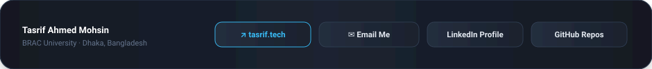

<!-- MAIN BENTO GRAPHIC (LIGHT THEME TABLET WIREFRAME) -->

 

<!-- QUICK SUMMARY STRIP (LIGHT FROSTED CARD) -->
<table border="0" cellpadding="0" cellspacing="0" width="100%" style="max-width: 960px; border-collapse: collapse;">
  <tr>
    <td align="center" style="padding: 16px 24px; background: #FFFFFF; border: 1px solid #E2E8F0; border-radius: 18px; box-shadow: 0 4px 12px rgba(100, 116, 139, 0.08);">
      

        👋 <b>Hi, I'm Tasrif Ahmed Mohsin</b> — CS undergrad at <b>BRAC University</b> building production-grade <b>AI & Computer Vision systems</b>, <b>Graph Traversal (DFS) optimizers</b>, and <b>deterministic robotics software</b>.
      

    </td>
  </tr>
</table>

 

<!-- FEATURED SYSTEMS REPOSITORY DIRECTORY (LIGHT THEME TABLE) -->
<table border="0" cellpadding="0" cellspacing="0" width="100%" style="max-width: 960px; border-collapse: collapse; box-shadow: 0 4px 12px rgba(100, 116, 139, 0.08);">
  <thead>
    <tr style="background: #F1F5F9; color: #475569; font-size: 11px; text-align: left; letter-spacing: 1.2px;">
      <th style="padding: 14px 20px; border-top-left-radius: 14px; border-bottom: 1px solid #CBD5E1;">FEATURED SYSTEM</th>
      <th style="padding: 14px 20px; border-bottom: 1px solid #CBD5E1;">ARCHITECTURE & STACK</th>
      <th style="padding: 14px 20px; border-bottom: 1px solid #CBD5E1;">DOMAIN</th>
      <th style="padding: 14px 20px; text-align: right; border-top-right-radius: 14px; border-bottom: 1px solid #CBD5E1;">REPOSITORY</th>
    </tr>
  </thead>
  <tbody style="font-size: 13px; color: #1E293B;">
    <tr style="background: #FFFFFF; border-bottom: 1px solid #E2E8F0;">
      <td style="padding: 14px 20px;"><b>🎯 Gun Detection with YOLOv10</b></td>
      <td style="padding: 14px 20px; color: #64748B;">Python · YOLOv10 · PyTorch · OpenCV</td>
      <td style="padding: 14px 20px;">Computer Vision / AI</td>
      <td style="padding: 14px 20px; text-align: right;"><a href="https://github.com/Tasrif-Ahmed-Mohsin/Gun-detection-with-yolov10" style="color: #059669; font-weight: 700; text-decoration: none;">View Repo ↗</a></td>
    </tr>
    <tr style="background: #F8FAFC; border-bottom: 1px solid #E2E8F0;">
      <td style="padding: 14px 20px;"><b>📍 Restaurant Success Predictor</b></td>
      <td style="padding: 14px 20px; color: #64748B;">Python · Streamlit · scikit-learn · Folium</td>
      <td style="padding: 14px 20px;">ML / Spatial Analytics</td>
      <td style="padding: 14px 20px; text-align: right;"><a href="https://github.com/Tasrif-Ahmed-Mohsin/Restaurant-Saga" style="color: #059669; font-weight: 700; text-decoration: none;">View Repo ↗</a></td>
    </tr>
    <tr style="background: #FFFFFF; border-bottom: 1px solid #E2E8F0;">
      <td style="padding: 14px 20px;"><b>🚇 Way-to-BRAC Pathfinder</b></td>
      <td style="padding: 14px 20px; color: #64748B;">Java · Swing GUI · Graph Traversal (DFS)</td>
      <td style="padding: 14px 20px;">Graph DSA / Optimization</td>
      <td style="padding: 14px 20px; text-align: right;"><a href="https://github.com/Tasrif-Ahmed-Mohsin/Way-to-BRAC" style="color: #059669; font-weight: 700; text-decoration: none;">View Repo ↗</a></td>
    </tr>
    <tr style="background: #F8FAFC; border-bottom: 1px solid #E2E8F0;">
      <td style="padding: 14px 20px;"><b>🤖 Robo-Pekka Robotics Engine</b></td>
      <td style="padding: 14px 20px; color: #64748B;">C++ · Embedded State Machines · Sensors</td>
      <td style="padding: 14px 20px;">Robotics / State Control</td>
      <td style="padding: 14px 20px; text-align: right;"><a href="https://github.com/Tasrif-Ahmed-Mohsin/Robo-Pekka" style="color: #059669; font-weight: 700; text-decoration: none;">View Repo ↗</a></td>
    </tr>
    <tr style="background: #FFFFFF;">
      <td style="padding: 14px 20px; border-bottom-left-radius: 14px;"><b>⚡ ICT Fest Hackathon Solution</b></td>
      <td style="padding: 14px 20px; color: #64748B;">Python · Rapid Prototyping · Core Loop</td>
      <td style="padding: 14px 20px;">Hackathon / Architecture</td>
      <td style="padding: 14px 20px; text-align: right; border-bottom-right-radius: 14px;"><a href="https://github.com/Tasrif-Ahmed-Mohsin/ICT_Fest_Hackathon_Preliminary_Tasrif" style="color: #059669; font-weight: 700; text-decoration: none;">View Repo ↗</a></td>
    </tr>
  </tbody>
</table>

 

<!-- GITHUB STATS & METRICS (LIGHT THEME) -->
<table border="0" cellpadding="0" cellspacing="0" width="100%" style="max-width: 960px; border-collapse: collapse;">
  <tr>
    <td width="50%" align="center" style="padding: 6px;">
      
    </td>
    <td width="50%" align="center" style="padding: 6px;">
      
    </td>
  </tr>
</table>

 

<!-- FOOTER CONNECT DOCK (LIGHT THEME) -->

 

<!-- DIRECT SOCIAL PILL BADGES -->

  
  &nbsp;
  
  &nbsp;
  
  &nbsp;
  

