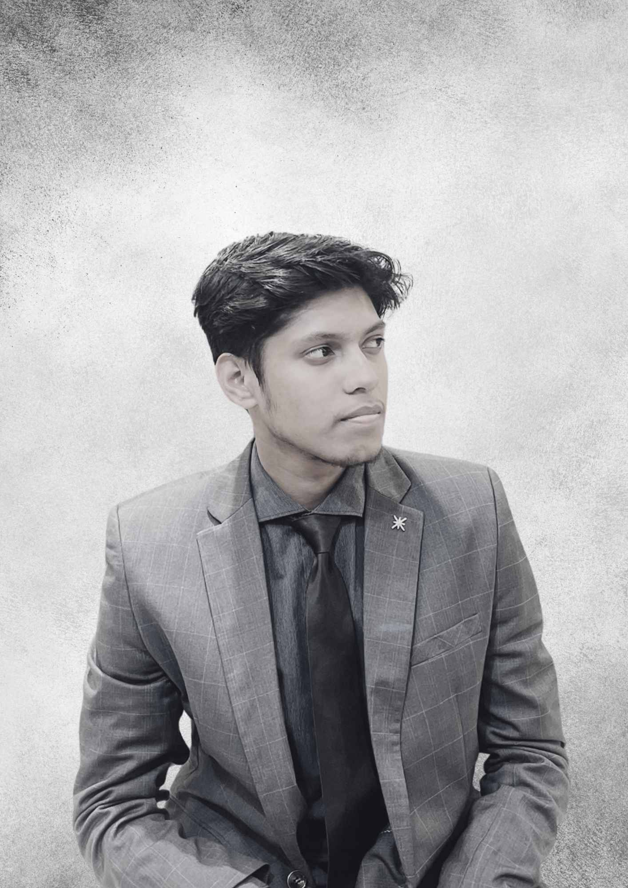

<!-- ANIMATED HEADER -->

 

<!-- PROFILE & BIO -->
<table border="0" cellpadding="0" cellspacing="0">
  <tr>
    <td align="center" valign="top" width="180" style="padding: 16px;">
      
    </td>
    <td align="left" valign="center" style="padding: 16px;">
      

        <strong>Hey, I'm Tasrif</strong> 👋
          
        CS undergrad at <strong>BRAC University</strong> who builds things that see, think, and move —
        from <strong>real-time gun detection with YOLOv10</strong> to <strong>autonomous robotics engines</strong>
        and <strong>graph-based pathfinding systems</strong>.
          
        I care about writing production-grade code, not just prototypes.
      

    </td>
  </tr>
</table>

<!-- SOCIAL BADGES -->

  &nbsp;
  &nbsp;
  &nbsp;
  

 

<!-- DIVIDER -->

 

<!-- ═══════════════════════════════════════════ -->
<!-- FEATURED PROJECTS                          -->
<!-- ═══════════════════════════════════════════ -->

## 🔬 Featured Projects

> *Things I've built that I'm proud of.*

<table>
  <tr>
    <td width="50%" valign="top">
      <h3><a href="https://github.com/Tasrif-Ahmed-Mohsin/Gun-detection-with-yolov10">🎯 Gun Detection — YOLOv10</a></h3>
      
Real-time firearm detection and localization using deep learning. Trained a custom YOLOv10 model for high-accuracy inference on live video streams.

      

        
        
        
        
      

    </td>
    <td width="50%" valign="top">
      <h3><a href="https://github.com/Tasrif-Ahmed-Mohsin/Restaurant-Saga">📍 Restaurant Success Predictor</a></h3>
      
ML-powered feasibility analysis for restaurant locations. Uses spatial heatmapping, economic modeling, and predictive scoring with an interactive Streamlit dashboard.

      

        
        
        
        
      

    </td>
  </tr>
  <tr>
    <td width="50%" valign="top">
      <h3><a href="https://github.com/Tasrif-Ahmed-Mohsin/Way-to-BRAC">🚇 Way-to-BRAC Pathfinder</a></h3>
      
Multimodal transit optimizer using graph traversal algorithms (DFS/BFS). Features a Java Swing GUI for interactive route visualization across Dhaka's transport network.

      

        
        
        
      

    </td>
    <td width="50%" valign="top">
      <h3><a href="https://github.com/Tasrif-Ahmed-Mohsin/Robo-Pekka">🤖 Robo-Pekka Robotics Engine</a></h3>
      
Deterministic autonomous robotics engine built with finite state machines and real-time sensor telemetry processing. Designed for predictable, reliable behavior.

      

        
        
        
      

    </td>
  </tr>
  <tr>
    <td width="50%" valign="top">
      <h3><a href="https://github.com/Tasrif-Ahmed-Mohsin/ICT_Fest_Hackathon_Preliminary_Tasrif">⚡ ICT Fest Hackathon Solution</a></h3>
      
Rapid prototyping solution built under time pressure during a competitive hackathon. Demonstrates fast problem-solving and clean implementation under constraints.

      

        
        
      

    </td>
    <td width="50%" valign="top">
      
  
        
      

    </td>
  </tr>
</table>

 

<!-- DIVIDER -->

 

<!-- ═══════════════════════════════════════════ -->
<!-- TECH STACK                                 -->
<!-- ═══════════════════════════════════════════ -->

## 🛠 Tech Stack

**`Languages`**

**`AI / ML & Computer Vision`**

**`Domains`**

 

<!-- DIVIDER -->

 

<!-- ═══════════════════════════════════════════ -->
<!-- GITHUB STATS                               -->
<!-- ═══════════════════════════════════════════ -->

## 📊 GitHub Stats

<table border="0" cellpadding="0" cellspacing="0">
  <tr>
    <td width="50%" align="center">
      
    </td>
    <td width="50%" align="center">
      
    </td>
  </tr>
</table>

 

<!-- GitHub Streak Stats -->

  

<!-- Activity Graph -->

  

<!-- DIVIDER -->

 

<!-- FOOTER -->

  

Built with focus and caffeine ☕ · <a href="https://www.tasrif.tech/">tasrif.tech</a>

