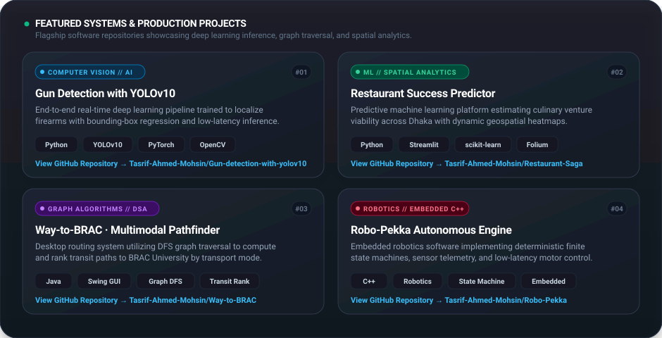

<!-- TACTILE NEUMORPHIC HERO WIDGET -->

  

<!-- QUICK BIO CARD -->
<table border="0" cellpadding="0" cellspacing="0" width="100%" style="max-width: 680px; border-collapse: collapse;">
  <tr>
    <td align="center" style="padding: 20px 28px; background: #E8EEF5; border: 1px solid #D5DFEC; border-radius: 28px; box-shadow: 6px 6px 16px rgba(184, 196, 212, 0.5), -6px -6px 16px #FFFFFF;">
      

        👋 <b>Hi, I'm Tasrif Ahmed Mohsin</b> — CS undergrad at <b>BRAC University</b> building production-grade <b>Computer Vision pipelines (YOLOv10 / PyTorch)</b>, <b>Graph Traversal algorithms (DFS)</b>, and <b>deterministic robotics software</b>.
      

    </td>
  </tr>
</table>

 

<!-- NEUMORPHIC SYSTEM REPOSITORIES CARD -->

  

<!-- CLICKABLE PROJECT DIRECTORY -->
<table border="0" cellpadding="0" cellspacing="0" width="100%" style="max-width: 680px; border-collapse: collapse; box-shadow: 6px 6px 16px rgba(184, 196, 212, 0.4), -6px -6px 16px #FFFFFF; border-radius: 20px; overflow: hidden;">
  <thead>
    <tr style="background: #DFE7F0; color: #475569; font-size: 11px; text-align: left; letter-spacing: 1.2px;">
      <th style="padding: 14px 18px;">FEATURED REPOSITORY</th>
      <th style="padding: 14px 18px;">STACK</th>
      <th style="padding: 14px 18px; text-align: right;">LINK</th>
    </tr>
  </thead>
  <tbody style="font-size: 13px; color: #1E293B;">
    <tr style="background: #E8EEF5; border-bottom: 1px solid #D5DFEC;">
      <td style="padding: 12px 18px;"><b>🎯 Gun Detection YOLOv10</b></td>
      <td style="padding: 12px 18px; color: #64748B;">Python · PyTorch · OpenCV</td>
      <td style="padding: 12px 18px; text-align: right;"><a href="https://github.com/Tasrif-Ahmed-Mohsin/Gun-detection-with-yolov10" style="color: #0284C7; font-weight: 700; text-decoration: none;">repo ↗</a></td>
    </tr>
    <tr style="background: #EFF4F9; border-bottom: 1px solid #D5DFEC;">
      <td style="padding: 12px 18px;"><b>📍 Restaurant Success Predictor</b></td>
      <td style="padding: 12px 18px; color: #64748B;">Python · Streamlit · scikit-learn</td>
      <td style="padding: 12px 18px; text-align: right;"><a href="https://github.com/Tasrif-Ahmed-Mohsin/Restaurant-Saga" style="color: #0284C7; font-weight: 700; text-decoration: none;">repo ↗</a></td>
    </tr>
    <tr style="background: #E8EEF5; border-bottom: 1px solid #D5DFEC;">
      <td style="padding: 12px 18px;"><b>🚇 Way-to-BRAC Pathfinder</b></td>
      <td style="padding: 12px 18px; color: #64748B;">Java · Swing GUI · Graph DFS</td>
      <td style="padding: 12px 18px; text-align: right;"><a href="https://github.com/Tasrif-Ahmed-Mohsin/Way-to-BRAC" style="color: #0284C7; font-weight: 700; text-decoration: none;">repo ↗</a></td>
    </tr>
    <tr style="background: #EFF4F9; border-bottom: 1px solid #D5DFEC;">
      <td style="padding: 12px 18px;"><b>🤖 Robo-Pekka Robotics Engine</b></td>
      <td style="padding: 12px 18px; color: #64748B;">C++ · Embedded State Machines</td>
      <td style="padding: 12px 18px; text-align: right;"><a href="https://github.com/Tasrif-Ahmed-Mohsin/Robo-Pekka" style="color: #0284C7; font-weight: 700; text-decoration: none;">repo ↗</a></td>
    </tr>
    <tr style="background: #E8EEF5;">
      <td style="padding: 12px 18px;"><b>⚡ ICT Fest Hackathon Solution</b></td>
      <td style="padding: 12px 18px; color: #64748B;">Python · Rapid Prototyping</td>
      <td style="padding: 12px 18px; text-align: right;"><a href="https://github.com/Tasrif-Ahmed-Mohsin/ICT_Fest_Hackathon_Preliminary_Tasrif" style="color: #0284C7; font-weight: 700; text-decoration: none;">repo ↗</a></td>
    </tr>
  </tbody>
</table>

  

<!-- GITHUB STATS -->
<table border="0" cellpadding="0" cellspacing="0" width="100%" style="max-width: 680px; border-collapse: collapse;">
  <tr>
    <td width="50%" align="center" style="padding: 6px;">
      
    </td>
    <td width="50%" align="center" style="padding: 6px;">
      
    </td>
  </tr>
</table>

 

<!-- DIRECT SOCIAL PILL BADGES -->

  
  &nbsp;
  
  &nbsp;
  
  &nbsp;
  

